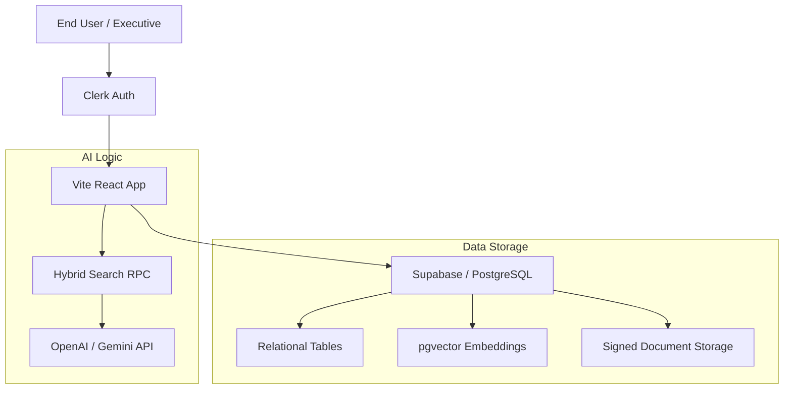
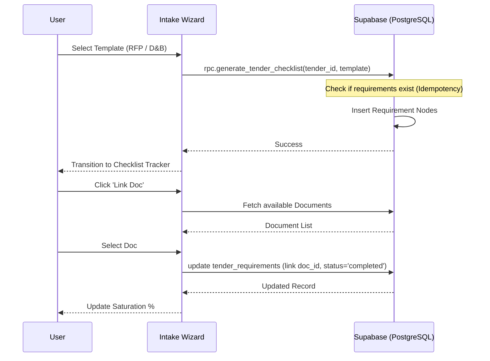
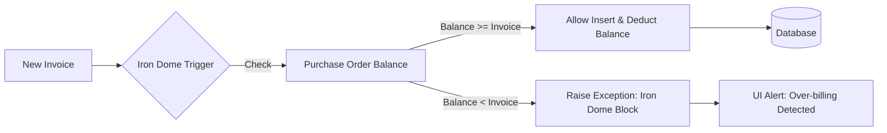
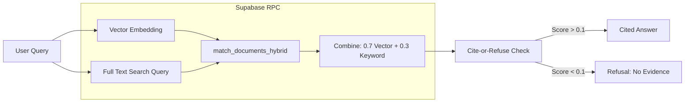

# SYSTEM ARCHITECTURE & WORKFLOW DIAGRAMS
Date: 2026-01-27
Status: v2.0 Production Baselined

## 1. System High-Level Architecture

## 2. Tender Intake & Checklist Workflow (Idempotent)

## 3. Financial Iron Dome (Over-billing Defense)

## 4. RAG Hybrid Retrieval Pipeline

## 5. Security & Permission Tiers (RBAC)
| Tier | Role Name | Capability |
| :--- | :--- | :--- |
| **L4** | Super Admin | System Settings, User Management, Global Audit |
| **L3** | Chairman / VP | Executive Cockpit, Reports, Agent Insights |
| **L2** | Dept Head / PM | Project Management, Tender Intake, Financials |
| **L1** | Staff / Engineer | Tasks, Document Viewing, Site Logs |
