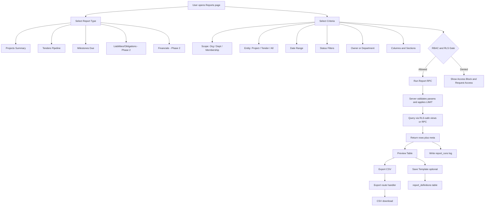
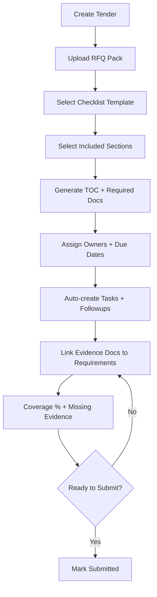

# DIAGRAMS.md — Mermaid Sources (paste into FigJam/Mermaid)
Date: 2026-01-26

## Reports Workflow
Figma export (already generated): https://www.figma.com/online-whiteboard/create-diagram/ba36e12f-adf9-45f2-b0bb-dc577ca7e26b?utm_source=chatgpt&utm_content=edit_in_figjam&oai_id=v1%2FEBTRyOxMvJfuyDkkkBc4MAkq89jjzT3DxO5Kz19rlg44L6NHSOr01B&request_id=d1eb33da-bd8b-4dd9-98ba-a96b74cc0463


## Tender Intake Wizard


## RAG Hybrid Retrieval
```mermaid
flowchart LR
  U[User Question] --> Q[Query Normalizer]
  Q --> F1[Structured Filters (project/tender/client/sensitivity)]
  Q --> BM25[FTS/BM25-like Search]
  Q --> VEC[Vector Search (pgvector)]
  F1 --> BM25
  F1 --> VEC
  BM25 --> FUSION[Score Fusion + Diversification]
  VEC --> FUSION
  FUSION --> TOPK[Top-K Chunks + Evidence Map]
  TOPK --> GEN[Answer Composer]
  GEN -->|Cite| OUT[Response with citations]
  GEN -->|Insufficient evidence| REFUSE[Refusal + next-best actions]

```

## Notifications Sweep
```mermaid
flowchart TD
  T[Trigger Sources] --> S[Notification Sweep]
  T --> T1[Tender deadline windows]
  T --> T2[Task due windows]
  T --> T3[Followup due next_followup_at]
  T --> T4[Milestone due windows]

  S --> DEDUPE[Compute dedupe_key per recipient/entity/window]
  DEDUPE --> UPSERT[Insert notifications ON CONFLICT DO NOTHING]
  UPSERT --> INBOX[User Inbox UI]
  INBOX --> ACK[Acknowledge]
  ACK --> STOP[Stop escalation for dedupe group]
  UPSERT --> ESC[Escalation rules (optional)]

```

## RBAC + RLS Enforcement
```mermaid
flowchart TD
  U[User] --> Clerk[Clerk AuthN]
  Clerk --> App[Next.js Server Components / Route Handlers]
  App --> RBAC{Server RBAC guard}
  RBAC -->|Denied| Deny[403 or redirect]
  RBAC -->|Allowed| SB[Supabase client (user session)]
  SB --> RLS{Supabase RLS}
  RLS -->|Permit| Rows[Rows returned]
  RLS -->|Block| Block[Empty/Denied]
  Rows --> UI[Render UI]
  Block --> UI2[Render access-limited state]

```
