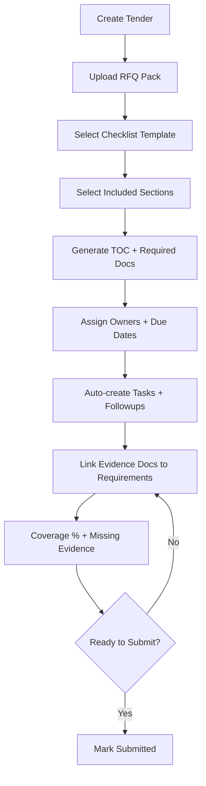

# INTERACTIONS & COMPONENTS — MCE Command Center v1.0
Date: 2026-01-26

## 1) UI Component Inventory (Front-end)
### AppShell (global)
- SidebarNav (collapsed/expanded, role-gated links)
- GlobalHeader
  - GlobalSearch (projects/tenders)
  - QuickActions (+New Project/+New Tender)
  - NotificationsBell (badge + dropdown)
  - Breadcrumbs

### Dashboard (by role)
- KPI_Card, TrendSparkline, RiskMeter
- ProjectPortfolioList + ProgressBarNeon
- TasksPanel (quick add + list)
- TenderCountdownWidget
- MilestonesDueWidget
- AlertsWidget

### Tenders
- TenderKanban / TenderListTable
- TenderDetailHeader (deadline countdown, status pill)
- IntakeWizard (template select → section pick → assign → generate)
- ChecklistTree (expand/collapse, section/requirement)
- EvidenceLinker (doc picker + attach note)
- CoverageBar (% + missing count)
- RFQDeltaBanner (phase 1.5)

### Reports (NEW)
- ReportBuilderPanel (criteria selectors)
- PreviewTable (sortable, paginated optional)
- ExportCSVButton (safe)
- SavedTemplates (optional)

### Documents
- FileExplorer (folder tree + grid)
- UploadModal (signed URL flow)
- SensitivityPicker (4 levels)
- VersionList (minimal)

### AI
- RagChatPanel (cited answers + refusal)
- AgentConsole (status grid + activity log; chat stub)

## 2) Backend Interactions (Request→Policy→Data→UI)
### Pattern: Server Guard + RLS
1) Route handler/server component loads user profile
2) Server RBAC guard checks role/tier
3) Supabase query runs under user session
4) RLS filters rows; UI renders safe empty/access-limited states

### Pattern: Wizard Transaction
- IntakeWizard → server action/RPC → transaction creates checklist+tasks+followups → audit_log entry → UI summary

### Pattern: Scheduled Sweep
- Cron triggers run_notification_sweep(now) → upsert notifications with dedupe → inbox shows items → ack stops escalation

## 3) Data Model Unification (high-level)
- clients → projects → milestones
- tenders → tender_checklists → tender_checklist_items → evidence links → documents
- tasks link to tender/project and drive notifications
- documents link to project/tender/checklist and drive extraction_jobs + chunks
- reports are derived (RPC/views) and logged via report_runs

## 4) Diagrams
- Reports: https://www.figma.com/online-whiteboard/create-diagram/ba36e12f-adf9-45f2-b0bb-dc577ca7e26b?utm_source=chatgpt&utm_content=edit_in_figjam&oai_id=v1%2FEBTRyOxMvJfuyDkkkBc4MAkq89jjzT3DxO5Kz19rlg44L6NHSOr01B&request_id=d1eb33da-bd8b-4dd9-98ba-a96b74cc0463
- Tender intake (Mermaid below)

## 5) Production Guardrails (anti-breaking)
- Feature flags for incomplete modules
- All new tables must have RLS + policies
- Export route always re-checks RBAC and run ownership
- UI never shows internal evaluation gates (only citations/refusals)

